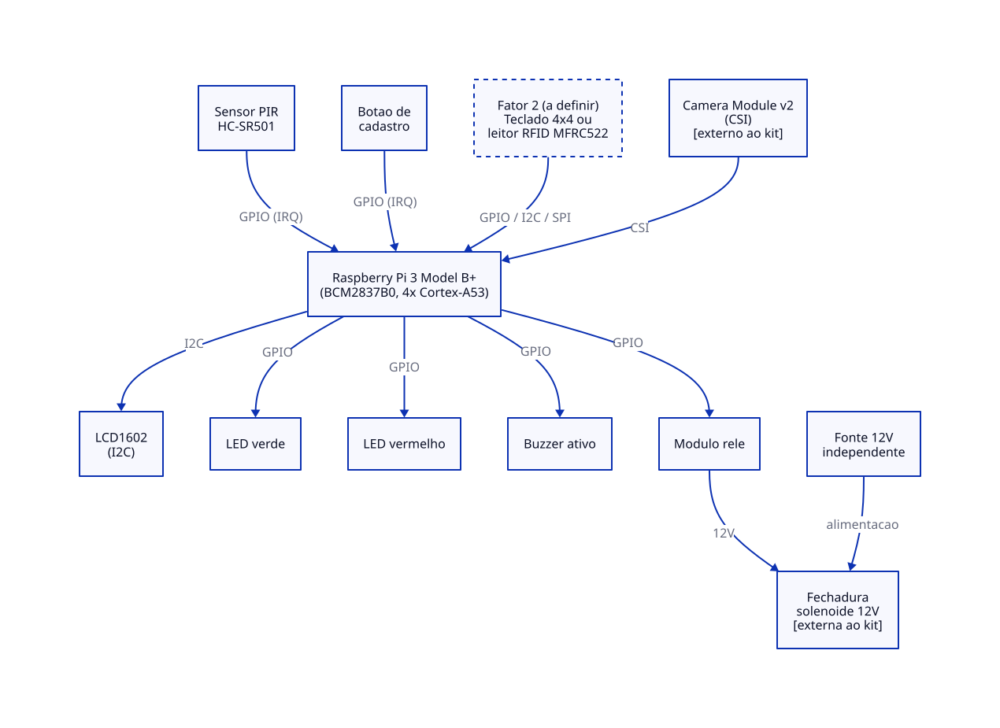
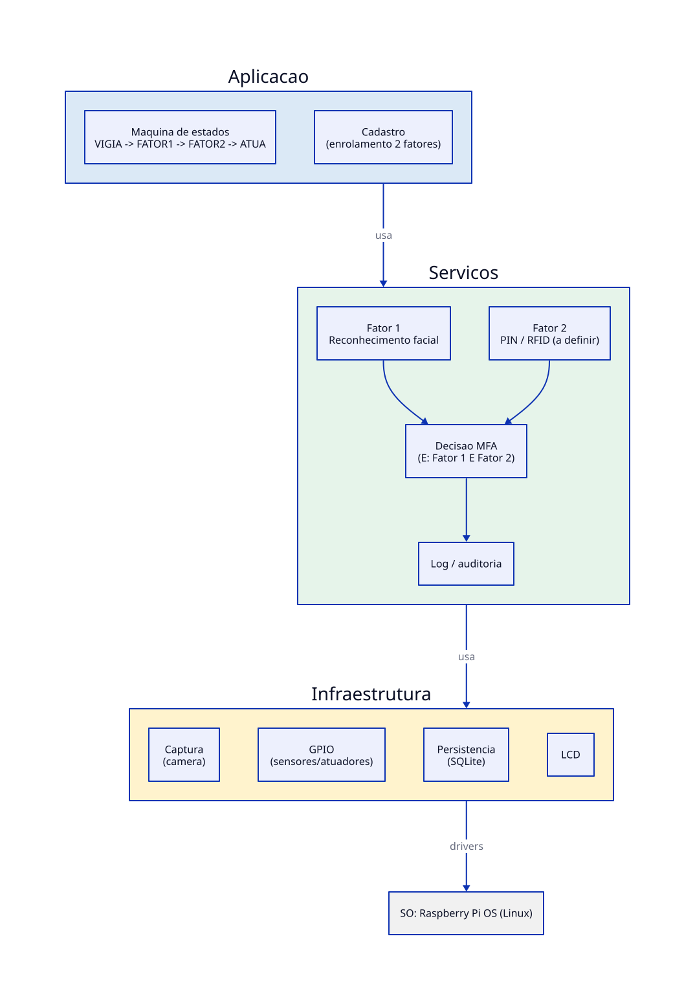
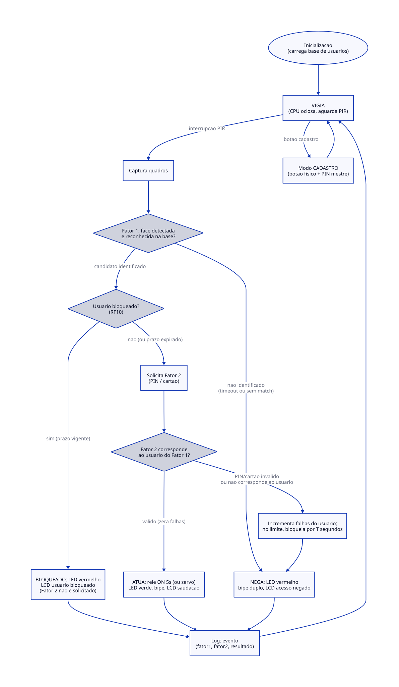

# Sentinel: Controle de Acesso Físico com Autenticação Multifator (MFA) em Raspberry Pi 3

**Disciplina:** PCS3732 - Laboratório de Processadores
**Plataforma:** Raspberry Pi 3 Model B+

**Kit de referência:** Freenove (Ultimate/Complete Starter Kit for Raspberry Pi)

**Membros do grupo:** Bruno Nicola Viola Ladosky, Luca Bompiani e Paulo José Cardoso Racy Ferreira

> **Status do documento:** entrega da Semana 1 (Estruturação do Projeto). Conteúdo é uma **proposta inicial**, refinada a partir de relatórios anteriores da disciplina (etapa do metrônomo) e de uma primeira arquitetura de reconhecimento facial puro, agora reorientada para autenticação **multifator**. Requisitos, componentes e diagramas aqui descritos ainda estão sujeitos a revisão nas próximas entregas (avaliação por pares na Semana 2, testes experimentais na Semana 3).

---

## 1. Motivação/Justificativa

Sistemas de controle de acesso baseados em um único fator (cartão, senha ou biometria isolada) têm vulnerabilidades conhecidas: cartões são clonáveis/perdíveis, senhas são compartilháveis, e biometria isolada (em particular reconhecimento facial) é suscetível a *spoofing* simples (foto impressa, vídeo em tela). A proposta deste projeto é um sistema de controle de acesso físico embarcado que exige **dois fatores independentes**,são eles reconhecimento facial (algo que o usuário *é*) combinado a um segundo fator possuído/conhecido (PIN ou cartão RFID), para autorizar a abertura de uma fechadura, operando de forma totalmente local (*edge computing*, sem dependência de nuvem).

Projetos similares consultados como referência de motivação:
- Sistemas comerciais de controle de acesso corporativo com biometria + cartão (ex.: catracas com leitor facial e RFID combinados).
- Trabalhos acadêmicos de reconhecimento facial em Raspberry Pi com bibliotecas `face_recognition`/dlib (ver referências).
- Documentação do kit Freenove, usado como base de componentes de hardware do projeto.

A escolha por MFA é o refinamento central desta entrega em relação à proposta anterior, pois um único fator biométrico, mesmo bem calibrado, não é suficiente como controle de acesso robusto, e a arquitetura precisa tratar a autenticação como a combinação obrigatória de dois mecanismos, não como fator único com um fallback opcional em caso de falha.

## 2. Objetivos

### 2.1 Objetivo geral

Projetar e implementar um sistema embarcado de controle de acesso físico com autenticação multifator (reconhecimento facial + PIN/cartão RFID) sobre Raspberry Pi 3 Model B+, operando de forma local e registrando eventos para auditoria.

### 2.2 Objetivos específicos

- Detectar presença de uma pessoa no ponto de acesso e capturar sua imagem.
- Reconhecer a face capturada contra uma base local de usuários cadastrados (Fator 1).
- Exigir um segundo fator independente (PIN via teclado matricial ou cartão RFID) para confirmar a identidade (Fator 2).
- Autorizar a abertura do acesso somente quando ambos os fatores forem validados.
- Sinalizar visual e sonoramente o resultado (autorizado/negado) em cada etapa.
- Permitir cadastro local de novos usuários com os dois fatores associados (enrolamento).
- Registrar eventos (tentativas, sucesso/falha por fator, cadastros) com data/hora para auditoria.
- Operar de forma 100% offline e tolerante a falhas de energia.

## 3. Requisitos

### 3.1 Requisitos funcionais

- **RF01:** Detectar a presença de uma pessoa no ponto de acesso. Critério de aceite: a detecção de presença dispara a captura em menos de 500 ms.
- **RF02:** Capturar imagem e detectar face no quadro (Fator 1, entrada). Critério de aceite: a face frontal deve ser detectada a 0,5–1,5 m da câmera.
- **RF03:** Reconhecer a face contra a base de cadastrados (Fator 1, verificação). Critério de aceite: a decisão de identificado/não identificado deve ocorrer em até 3 s após o enquadramento.
- **RF04:** Solicitar o segundo fator (PIN ou cartão RFID) somente após o Fator 1 identificar um candidato (Fator 2, entrada). Critério de aceite: o LCD deve solicitar o segundo fator e o tempo de espera deve ser limitado por um timeout configurável.
- **RF05:** Validar o segundo fator contra o cadastro do usuário identificado no Fator 1 (Fator 2, verificação). Critério de aceite: o PIN ou UID do cartão deve corresponder ao usuário do Fator 1, e não a qualquer outro usuário da base.
- **RF06:** Abrir o acesso somente quando os Fatores 1 e 2 forem válidos para o mesmo usuário. Critério de aceite: a fechadura deve ser acionada por 5 s, com feedback visual (LED verde) e sonoro.
- **RF07:** Negar e sinalizar caso qualquer um dos fatores falhe. Critério de aceite: deve ocorrer LED vermelho, bipe distinto, acesso mantido travado e registro do motivo da falha (qual fator).
- **RF08:** Cadastrar usuários localmente com os dois fatores (enrolamento). Critério de aceite: o fluxo deve ocorrer por botão físico + PIN mestre de operador, com captura de N amostras faciais e associação do segundo fator (PIN definido ou cartão lido).
- **RF09:** Registrar eventos com data e hora (tentativa, resultado por fator, acesso concedido/negado e cadastro). Critério de aceite: o log deve ser persistente e consultável após reinício.

### 3.2 Requisitos não funcionais

- **RNF01:** Minimizar a taxa de falsa aceitação (FAR) do sistema pela combinação dos fatores. Critério de aceite: a FAR composta deve ser estimada empiricamente e aproximar-se de FAR(Fator 1) × FAR(Fator 2).
- **RNF02:** Operar 100% offline. Critério de aceite: nenhuma função deve depender de Internet.
- **RNF03:** Ser tolerante a falhas de energia. Critério de aceite: o estado da base de usuários e dos logs deve ser persistido, e a fechadura deve operar em modo fail-secure.
- **RNF04:** Garantir privacidade conforme a LGPD. Critério de aceite: dados biométricos devem ser armazenados localmente apenas como vetores de características, o PIN deve ser armazenado com hash e deve existir consentimento no cadastro.
- **RNF05:** Manter o tempo total de autenticação dos dois fatores dentro de um limite aceitável. Critério de aceite: o tempo total deve ser inferior ou igual a 8 s, do início da presença até a decisão final, a calibrar nos testes.

> **Em aberto para a Semana 2:** definição final do segundo fator, PIN via teclado matricial 4×4 (baseline, presente em qualquer versão do kit) ou leitor RFID MFRC522 (kits Complete/Ultra).

## 4. Diagramas da arquitetura

### 4.1 Arquitetura física

Blocos: sensor de presença (PIR), câmera CSI, teclado matricial/leitor RFID (2º fator), LCD, indicadores (LED/buzzer), relé + fechadura, tudo conectado à Raspberry Pi 3. Fonte editável: [docs/diagramas/arquitetura_fisica.d2](diagramas/arquitetura_fisica.d2).

### 4.2 Arquitetura de software

Organização em camadas (Aplicação / Serviços / Infraestrutura / SO), com o serviço de decisão MFA isolado dos dois serviços de verificação de fator (facial e PIN/RFID). Fonte editável: [docs/diagramas/arquitetura_software.d2](diagramas/arquitetura_software.d2).

### 4.3 Fluxo de autenticação (máquina de estados)

Os dois fatores estão em **série obrigatória (E)**, de modo que a falha em qualquer um interrompe o fluxo, e não em esquema de fallback (OU). Fonte editável: [docs/diagramas/fluxo_mfa.d2](diagramas/fluxo_mfa.d2).

> Diagramas de sequência detalhados (autorizado / negado) e a rastreabilidade requisito→arquitetura serão incorporados a partir da Semana 3, junto com evidências de teste.

## 5. Ferramentas utilizadas

### 5.1 Linguagens
- Python 3 (aplicação principal, pipeline de visão, controle de GPIO)

### 5.2 Bibliotecas/Frameworks (candidatas, a confirmar com testes)
- `face_recognition` / `dlib` para detecção e extração de embeddings faciais
- `Picamera2` para captura de vídeo via CSI
- `gpiozero` / `lgpio` para controle de GPIO (PIR, relé, LEDs, buzzer, teclado)
- `SQLite3` (via `sqlite3` padrão do Python) para persistência de usuários (embeddings + segundo fator) e logs
- `RPLCD` ou equivalente para controle do LCD1602 via I2C

### 5.3 Hardware
- Raspberry Pi 3 Model B+ (kit Freenove Ultimate/Complete Starter Kit)
- Sensor PIR HC-SR501
- Câmera Raspberry Pi Camera Module v2 (CSI): item externo ao kit
- Teclado matricial 4×4 e/ou leitor RFID MFRC522 (segundo fator)
- LCD1602 I2C, LEDs (verde/vermelho), buzzer ativo
- Módulo relé + fechadura solenoide 12 V (fechadura externa ao kit)

## 6. Metodologia de desenvolvimento

Desenvolvimento incremental, com entregas semanais versionadas no GitHub (uma Release por semana) e histórico de commits granular por funcionalidade/etapa. Desejamos evitar *mega commits*. Uso de branches e Pull Requests durante o desenvolvimento, convergindo para uma única branch `main` na entrega final. Estrutura de pastas do repositório organizada por camada de software (`src/sentinel/app`, `services`, `infra`).

## 7. Testes planejados

Nesta primeira entrega, os testes ainda não foram executados, mas a seção a seguir lista o que está planejado para as próximas semanas.

- **RF01:** Medir a latência entre a presença física e o disparo da captura.
- **RF02/RF03:** Avaliar a taxa de detecção e reconhecimento facial em diferentes distâncias, iluminação e ângulos.
- **RF04/RF05:** Validar que o segundo fator está vinculado ao usuário identificado no Fator 1, não aceitando PIN ou cartão de outro usuário.
- **RF06/RF07:** Testar a abertura somente quando os dois fatores estiverem corretos e a negação quando um fator falhar isoladamente.
- **RF08:** Testar o fluxo de cadastro completo, incluindo amostras faciais e segundo fator, além de rejeitar amostras de baixa qualidade.
- **RNF01:** Estimar FAR/FRR de cada fator isoladamente e da combinação, com um conjunto de teste do grupo.
- **RNF03:** Simular queda de energia durante a escrita no SQLite e verificar a integridade da base após o reinício.
- **RNF05:** Medir o tempo total do fluxo completo de autenticação com os dois fatores.

## Referências (ABNT NBR 6023)

> AHONEN, T.; HADID, A.; PIETIKÄINEN, M. Face description with local binary patterns: application to face recognition. **IEEE Transactions on Pattern Analysis and Machine Intelligence**, v. 28, n. 12, p. 2037–2041, 2006.

> BRASIL. **Lei nº 13.709, de 14 de agosto de 2018** (Lei Geral de Proteção de Dados Pessoais, LGPD). Diário Oficial da União: Brasília, DF, 15 ago. 2018.

> FREENOVE. **Freenove Ultimate Starter Kit for Raspberry Pi — Tutorial**. Shenzhen: Freenove Technology, 2023. Disponível em: https://github.com/Freenove/Freenove_Ultimate_Starter_Kit_for_Raspberry_Pi. Acesso em: 28 jul. 2026.

> GEITGEY, A. **face_recognition: the world's simplest facial recognition API for Python**. 2018. Disponível em: https://github.com/ageitgey/face_recognition. Acesso em: 28 jul. 2026.

> KING, D. E. Dlib-ml: a machine learning toolkit. **Journal of Machine Learning Research**, v. 10, p. 1755–1758, 2009.

> RASPBERRY PI FOUNDATION. **Raspberry Pi Camera Module documentation**. 2024. Disponível em: https://www.raspberrypi.com/documentation/accessories/camera.html. Acesso em: 28 jul. 2026.
